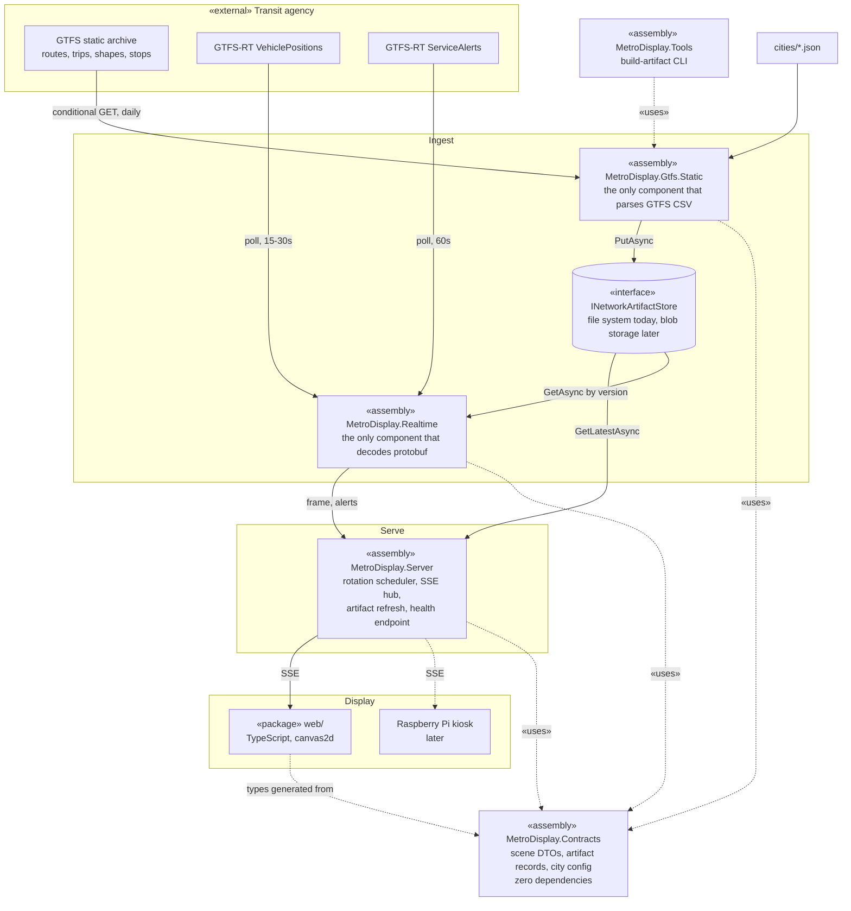
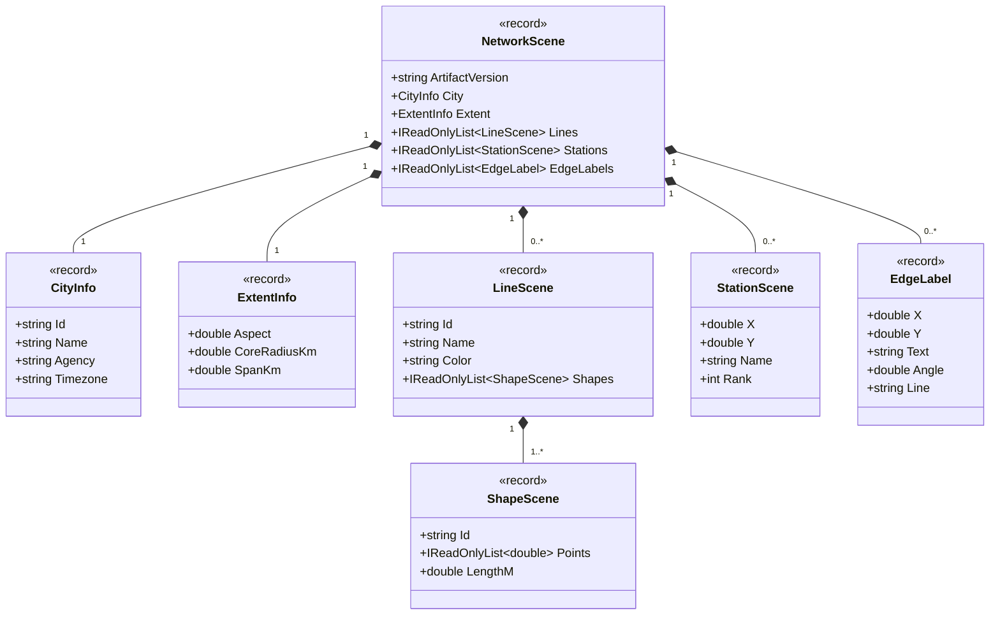
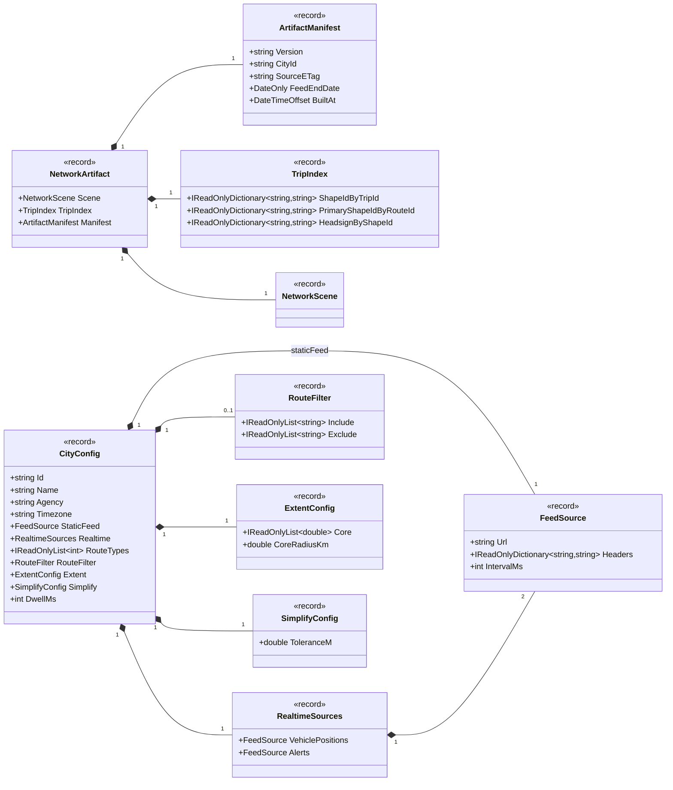
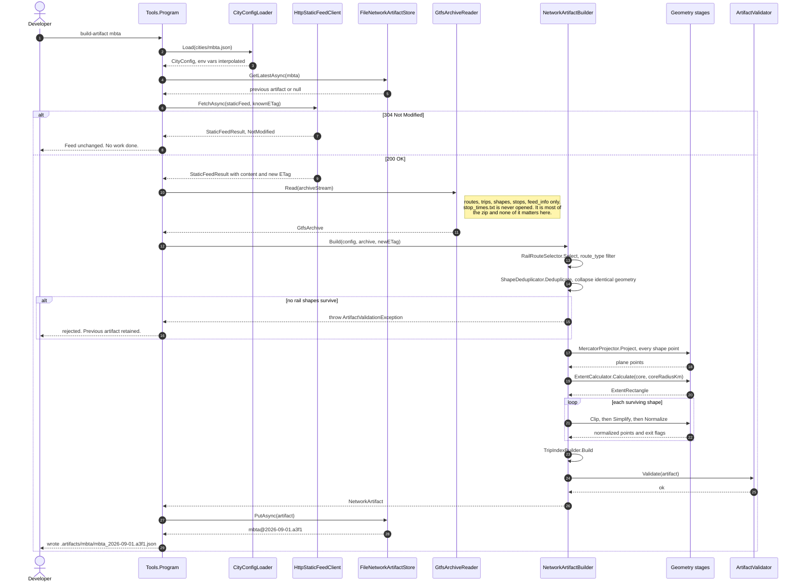
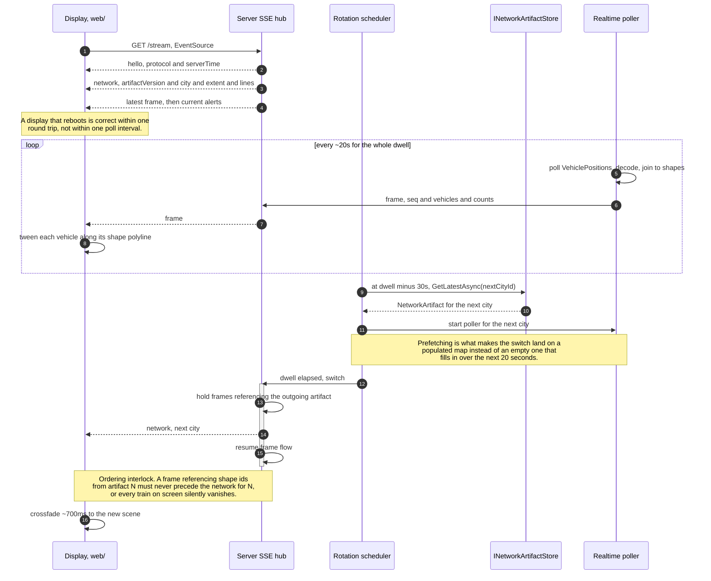
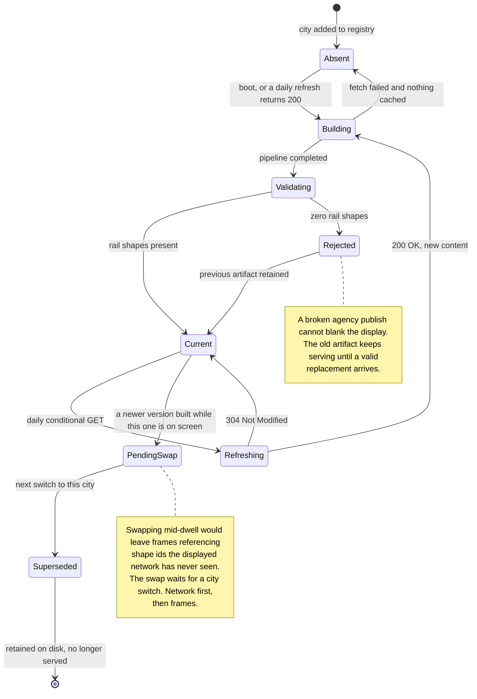
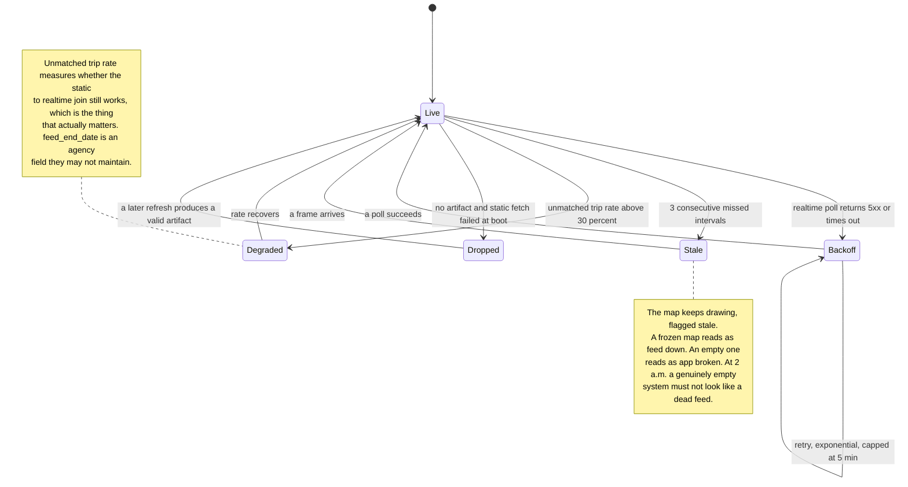
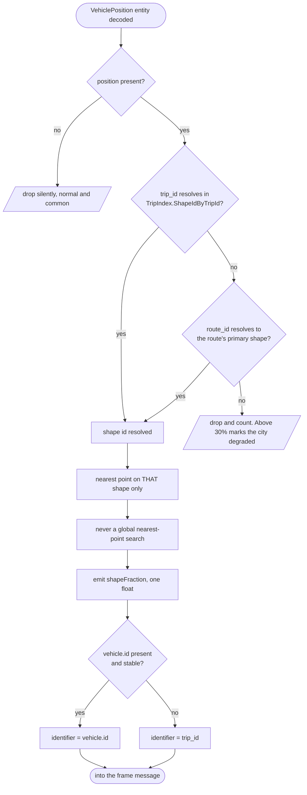

# MetroDisplay — UML Diagrams

Structural and behavioural models for the system described in
`docs/specs/2026-09-22-metrodisplay-design.md` and implemented by the plans under
`docs/plans/`.

Diagrams are Mermaid, so they render on GitHub and in any Markdown preview with Mermaid
support, and they diff as text.

**Implementation status:** `Contracts`, `Gtfs.Static` and `Tools` are fully specified by
Plan 1. `Realtime`, `Server` and `web/` are designed in the spec but not yet planned in
detail, so the diagrams covering them model intent rather than committed signatures.

## Contents

1. [Component and package structure](#1-component-and-package-structure)
2. [Class — wire contract DTOs](#2-class--wire-contract-dtos)
3. [Class — artifact and city config](#3-class--artifact-and-city-config)
4. [Class — geometry value types and transforms](#4-class--geometry-value-types-and-transforms)
5. [Class — orchestration, storage and feeds](#5-class--orchestration-storage-and-feeds)
6. [Sequence — building an artifact](#6-sequence--building-an-artifact)
7. [Sequence — display connect and one rotation cycle](#7-sequence--display-connect-and-one-rotation-cycle)
8. [State — artifact lifecycle](#8-state--artifact-lifecycle)
9. [State — per-city feed health](#9-state--per-city-feed-health)
10. [Activity — projecting a vehicle onto its shape](#10-activity--projecting-a-vehicle-onto-its-shape)
11. [Open discrepancies](#11-open-discrepancies)

---

## 1. Component and package structure

`Gtfs.Static` and `Realtime` never call each other. They meet only through a
`NetworkArtifact` referenced by version id — which is why a GTFS CSV concern can never leak
into the protobuf component, and vice versa.

### The same structure in n-layer terms

| Component | n-layer equivalent |
|---|---|
| `MetroDisplay.Contracts` | The shared model assembly. Every layer references it; it references nothing. |
| `MetroDisplay.Gtfs.Static`, `MetroDisplay.Realtime` | Business Layer — the transforms. Their feed clients are the inbound half of the Data Access Layer. |
| `INetworkArtifactStore` / `FileNetworkArtifactStore` | Data Access Layer — persistence, behind an interface. |
| `MetroDisplay.Server` | Presentation Layer — serves the wire contract over SSE. |
| `web/` | Presentation Layer — the view. |

The one mechanical difference from textbook n-layer: `INetworkArtifactStore` is declared next
to the business code that consumes it, not inside a separate data assembly that the business
code references. The compile-time dependency points inward; runtime flow is unchanged — the
business code still calls the store, exactly as it would in n-layer.

---

## 2. Class — wire contract DTOs

`MetroDisplay.Contracts`. These serialize directly to the `network` message in spec §8, and
the TypeScript renderer types are generated from them.

`ShapeScene.Points` is a flat `[x0, y0, x1, y1, ...]` array of normalized coordinates, not a
list of point objects. One array of doubles per shape instead of thousands of two-field
objects is the difference between a ~200 KB scene and a multi-megabyte one.

---

## 3. Class — artifact and city config

Nullable in the C#, shown without the marker above for diagram legibility:
`ArtifactManifest.FeedEndDate`, `CityConfig.RouteFilter`, `FeedSource.Headers`,
`RouteFilter.Include`, `RouteFilter.Exclude`.

`ExtentConfig.Core` is `[latitude, longitude]` and `CoreRadiusKm` is **ground** distance, not
Mercator plane distance. Converting between them is `MercatorProjector`'s job, and skipping
that conversion shrinks every extent by roughly a quarter at Boston's latitude while still
looking plausible.

---

## 4. Class — geometry value types and transforms

Every transform here is a static class over immutable value types: no state, no injection,
nothing to mock. That is what lets the pipeline tests run against a synthetic fixture with no
network and no API keys.

```mermaid
classDiagram
  direction TB

  class GeoPoint {
    <<readonly record struct>>
    +double Latitude
    +double Longitude
  }

  class PlanePoint {
    <<readonly record struct>>
    +double X
    +double Y
  }

  class ExtentRectangle {
    <<readonly record struct>>
    +double MinX
    +double MinY
    +double MaxX
    +double MaxY
  }

  class ClippedPolyline {
    <<record>>
    +IReadOnlyList~PlanePoint~ Points
    +bool ExitsAtStart
    +bool ExitsAtEnd
  }

  class MercatorProjector {
    <<static>>
    +Project(GeoPoint point) PlanePoint
    +GroundMetresToPlane(double groundMetres, double latitudeDegrees) double
    +PlaneMetresToGround(double planeMetres, double latitudeDegrees) double
  }

  class ExtentCalculator {
    <<static>>
    +Calculate(ExtentConfig config, IEnumerable~PlanePoint~ contentPoints) ExtentRectangle
  }

  class PolylineClipper {
    <<static>>
    +Clip(IReadOnlyList~PlanePoint~ points, ExtentRectangle extent) IReadOnlyList~ClippedPolyline~
  }

  class PolylineSimplifier {
    <<static>>
    +Simplify(IReadOnlyList~PlanePoint~ points, double toleranceInPlaneUnits) IReadOnlyList~PlanePoint~
  }

  class CoordinateNormalizer {
    <<static>>
    +Normalize(IReadOnlyList~PlanePoint~ points, ExtentRectangle extent) IReadOnlyList~double~
  }

  MercatorProjector ..> GeoPoint : consumes
  MercatorProjector ..> PlanePoint : produces
  ExtentCalculator ..> PlanePoint : consumes
  ExtentCalculator ..> ExtentRectangle : produces
  PolylineClipper ..> ExtentRectangle : consumes
  PolylineClipper ..> ClippedPolyline : produces
  PolylineSimplifier ..> PlanePoint : consumes
  CoordinateNormalizer ..> ExtentRectangle : consumes
```

The call order between these is fixed and not obvious: project, compute extent, **clip, then
simplify**. Simplifying first spends the Douglas–Peucker tolerance budget on geometry that
runs 40 km off-screen and is about to be discarded anyway.

---

## 5. Class — orchestration, storage and feeds

```mermaid
classDiagram
  direction TB

  class NetworkArtifactBuilder {
    <<static>>
    +Build(CityConfig config, GtfsArchive archive, string sourceETag) NetworkArtifact
  }

  class GtfsArchiveReader {
    <<static>>
    +Read(Stream archiveStream) GtfsArchive
  }

  class RailRouteSelector {
    <<static>>
    +Select(GtfsArchive archive, CityConfig config) RailSelection
  }

  class ShapeDeduplicator {
    <<static>>
    +Deduplicate(IReadOnlyList~RawShape~ shapes) DeduplicationResult
  }

  class TripIndexBuilder {
    <<static>>
    +Build(IReadOnlyList~GtfsTrip~ trips, IReadOnlyDictionary~string,string~ canonicalShapeIdByOriginalId) TripIndex
  }

  class ArtifactValidator {
    <<static>>
    +Validate(NetworkArtifact artifact) void
  }

  class ArtifactValidationException {
    <<exception>>
  }

  class CityConfigLoader {
    <<static>>
    +Load(string configPath) CityConfig
  }

  class INetworkArtifactStore {
    <<interface>>
    +GetLatestAsync(string cityId, CancellationToken cancellationToken) Task~NetworkArtifact~
    +GetAsync(string cityId, string version, CancellationToken cancellationToken) Task~NetworkArtifact~
    +PutAsync(NetworkArtifact artifact, CancellationToken cancellationToken) Task~string~
    +ListVersionsAsync(string cityId, CancellationToken cancellationToken) Task~IReadOnlyList~string~~
  }

  class FileNetworkArtifactStore {
    +FileNetworkArtifactStore(string rootDirectory)
  }

  class IStaticFeedClient {
    <<interface>>
    +FetchAsync(FeedSource source, string knownETag, CancellationToken cancellationToken) Task~StaticFeedResult~
  }

  class HttpStaticFeedClient {
    +HttpStaticFeedClient(HttpClient httpClient)
  }

  class StaticFeedResult {
    <<record>>
    +bool NotModified
    +Content
    +string ETag
  }

  FileNetworkArtifactStore ..|> INetworkArtifactStore
  HttpStaticFeedClient ..|> IStaticFeedClient
  IStaticFeedClient ..> StaticFeedResult : produces
  ArtifactValidator ..> ArtifactValidationException : throws
  NetworkArtifactBuilder ..> RailRouteSelector : uses
  NetworkArtifactBuilder ..> ShapeDeduplicator : uses
  NetworkArtifactBuilder ..> TripIndexBuilder : uses
  NetworkArtifactBuilder ..> ArtifactValidator : uses
  NetworkArtifactBuilder ..> NetworkArtifact : produces
  GtfsArchiveReader ..> GtfsArchive : produces
  CityConfigLoader ..> CityConfig : produces
```

`StaticFeedResult.Content` is `byte[]?` — null exactly when `NotModified` is true. `ETag` is
nullable for the same reason. The `Get*` methods on `INetworkArtifactStore` return null when
nothing matches; nullable markers are dropped above for diagram legibility.

Both interfaces exist for the same reason: they are the two places this system touches the
outside world. Everything between them is a pure function over bytes.

---

## 6. Sequence — building an artifact

`dotnet run --project src/MetroDisplay.Tools -- build-artifact mbta`

Validation happens **before** `PutAsync`, never after. An agency publishing a broken feed
overnight must not be able to blank the display.

---

## 7. Sequence — display connect and one rotation cycle

Models spec §8 flow rules and §9 rotation. Implemented in Plans 3 and 4.

---

## 8. State — artifact lifecycle

Why versioning is load-bearing rather than bookkeeping.

---

## 9. State — per-city feed health

Models the detection and response columns of spec §12.

---

## 10. Activity — projecting a vehicle onto its shape

Runs once per vehicle per poll in `MetroDisplay.Realtime`.

Constraining the nearest-point search to the vehicle's own shape is not an optimisation, it
is correctness. A global search puts trains on the wrong line wherever routes share
trackage, which is most of the MBTA Green Line core and all of BART's Market Street tunnel.

Emitting `shapeFraction` rather than latitude and longitude is what keeps every client cheap.
Shipping coordinates would force each display to solve nearest-point-on-polyline, an
O(segments) search per vehicle per frame, before it could draw a single dot.

---

## 11. Open discrepancies

Found while drawing these. Neither is urgent; both want a decision before the code sets.

1. **Where the CLI lives.** Spec §3 lists `MetroDisplay.Gtfs.Static` as "Library + CLI".
   Plan 1's file structure puts the CLI in a separate `src/MetroDisplay.Tools/Program.cs`.
   The plan's split is the better shape — it keeps a host entry point and its argument
   parsing out of a library that `Server` and `Realtime` both reference — so spec §3's
   project list should be updated to match, rather than the other way round.

2. **Where `INetworkArtifactStore` is declared.** Plan 1 puts both the interface and
   `FileNetworkArtifactStore` under `MetroDisplay.Gtfs.Static/Storage/`. `Server` and
   `Realtime` are both consumers of the store, so each would have to reference
   `Gtfs.Static` — the component that parses CSV — purely to see a persistence interface.
   Moving the interface into `MetroDisplay.Contracts` and leaving the file implementation in
   `Gtfs.Static` costs nothing now and avoids that reference later.
