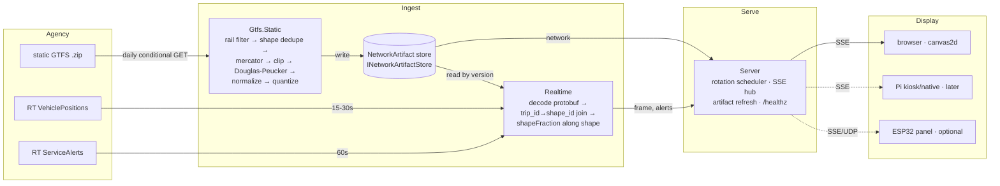

# MetroDisplay — Design

**Date:** 2026-09-22
**Status:** Approved, pre-implementation

---

## 1. Overview

MetroDisplay is an always-on display that renders a rail transit system as a minimal
wireframe map with live vehicle positions drawn from GTFS-RT feeds. It rotates between
cities on a fixed dwell (~5 minutes each).

It should read as art from across a room and reward close inspection with real data.

**v1 target:** a web page. **Endgame:** a small dedicated screen driven by a Raspberry Pi
or similar. The architecture treats the browser as one renderer among several rather than
as the product, so the second renderer is a transcription rather than a redesign.

### Goals

- Rail-focused: metro, light rail, commuter rail, rail hybrids. No buses.
- Geographically truthful map at uniform scale, wireframe aesthetic.
- Live vehicle positions with continuous motion, not periodic twitching.
- Adding a city is a config file, not code.
- The display can be dumb enough to reimplement on constrained hardware.

### Non-goals (v1)

- Interactivity. Nothing is clickable; there is no input device.
- Trip planning, arrival predictions, or per-station detail.
- Bus networks, which are too dense for this treatment and would swamp the map.
- Historical data, playback, or storage of feed history.

---

## 2. Decisions

| Axis | Decision |
|---|---|
| Map geometry | Simplified geographic. True bearings, Douglas–Peucker simplification. Never schematic/octolinear. |
| Scale | Uniform. One meters-per-unit for the whole map; no compression or warping of any branch. |
| Extent | Real-distance radius from a configured city core point. |
| Overflow | Hard clip at the extent edge, with a `TO <TERMINUS>` label so the cut reads as deliberate. |
| Screen layout | Full-width map with a dense bottom rail (counts, alert ticker, rotation progress). |
| Vehicle motion | Tween along the track polyline between polls. No dead reckoning in v1. |
| RT feeds | VehiclePositions + ServiceAlerts. No TripUpdates in v1. |
| Topology | Hosted backend, thin displays. One feed poll regardless of display count. |
| Scene contract | Normalized unit-space coordinates, server-side projection. Split into `network` and `frame` messages. |
| Transport | Server-Sent Events. `POST /control` reserved for future input. |
| Transition | Crossfade, ~700 ms. |
| Backend | .NET |
| Renderer | TypeScript, canvas2d |
| Static GTFS | Separate project building versioned artifacts, run in-process; daily conditional refresh. |

### Rationale on the contested ones

**Why not octolinear.** A Beck-style diagram is the most recognisable transit map form, but
good octolinear layout is an NP-hard optimisation that is hand-drawn in practice. It also
breaks the lat/lon → screen identity, forcing every vehicle through a snap-to-segment step
against hand-authored geometry. That converts "add a city = config file" into "add a city =
an afternoon of drawing". Deferred, not rejected: the contract carries projected
coordinates, so a per-city hand-drawn override could be added later for a favourite city
without touching the pipeline.

**Why clip rather than compress.** Long outlying branches (BART to Antioch, WMATA to
Ashburn) otherwise squash the dense core into a fraction of the screen. Compressing them
with a log or radial warp would preserve the endpoints but destroy the property that makes
the map worth looking at: that 2 km downtown and 2 km in the suburbs are the same length on
screen. Clipping keeps scale honest and loses only geometry that was unreadable anyway.

**Why tween and not dead reckoning.** Dead reckoning shows where a train *is* rather than
where it *was*, which is more truthful in principle. In practice `vehicle.position.speed`
and `.bearing` are optional in the GTFS-RT spec and frequently absent, so it would silently
degrade to snapping on some cities, and visible snap-backs when a prediction is wrong look
worse than a consistent lag. Both options share all the hard machinery (projection onto a
distance-along-shape), so adding dead reckoning later is cheap.

**Why SSE and not WebSocket.** No data flows client→server after the handshake; displays
are pure receivers, so WebSocket's duplex capability is unused. SSE is a plain HTTP GET, so
no upgrade handshake to be mangled by proxies. `EventSource` provides reconnect-with-backoff
and `Last-Event-ID` as battle-tested browser code, which matters for an unattended display
that will drop its connection constantly. The `seq` field maps onto SSE's `id:` for free.
On an ESP32 it is a long-lived GET plus line parsing, with no WebSocket library. The one
thing WebSocket would buy is binary frames; at ~2 KB per frame, base64's 33% overhead is
not a constraint. Future control input belongs on a stateless `POST /control`, not folded
into the render stream.

---

## 3. Architecture



### Projects

```
MetroDisplay.Contracts      Scene DTOs + city config schema. Zero dependencies.
MetroDisplay.Gtfs.Static    Library + CLI. Builds versioned NetworkArtifacts.
MetroDisplay.Realtime       GTFS-RT polling, protobuf decode, RT→static join.
MetroDisplay.Server         ASP.NET Core. Rotation, SSE, artifact refresh, health.
web/                        Vite + TypeScript renderer (canvas2d).
cities/                     One JSON per city.
docs/design/mockups/        Design mockups from the brainstorming session.
```

### Boundaries

- `Contracts` has no dependencies. TypeScript types are generated from it, so a renamed
  field breaks the renderer build rather than silently rendering nothing at runtime.
- `Gtfs.Static` is the only component that parses GTFS CSVs. `Realtime` is the only
  component that decodes protobuf. Neither calls the other; they meet only through a
  `NetworkArtifact` referenced by version id.
- Fetching is injected at the edge of both ingest components. Everything downstream of it —
  static pipeline stages 2–8, and the whole realtime join — is a pure function over bytes,
  so those tests run against committed fixtures with no network and no API keys.
- `INetworkArtifactStore` is the extraction seam: disk today, blob storage later, with
  no caller changes. The same CLI can run as a scheduled container if the in-process job
  ever becomes inadequate.

### Why canvas2d and not SVG

A few hundred tweened vehicles at 60 fps is where SVG's per-node DOM cost begins to bite.
More importantly, canvas is immediate-mode — the same five drawing operations a Pi
framebuffer renderer would implement. Writing the browser renderer in canvas makes the
native port a transcription.

---

## 4. Coordinate system

One transform, applied server-side, once per city.

1. **Project.** lat/lon → Web Mercator (EPSG:3857). Rail systems span under 100 km, so
   Mercator's area distortion is irrelevant; what matters is that it is conformal, so the
   network keeps its real shape.
2. **Extent.** The intersection of the content bounding box with a box of side
   `2 · coreRadiusKm` in metres, centred on the configured core point (see §5).
3. **Normalize by the longer axis.**

```
spanX       = maxX - minX
spanY       = maxY - minY
longestSpan = max(spanX, spanY)

normalizedX = (mercatorX - minX) / longestSpan
normalizedY = (maxY - mercatorY) / longestSpan   // flipped: screen convention
aspect      = spanX / spanY
```

Two properties fall out of this, both load-bearing:

- **Dividing both axes by the same `longestSpan` makes distortion impossible.** A renderer that
  ignores `aspect` entirely still draws a correctly-proportioned map; it only letterboxes
  wrong. That is a good failure mode for a renderer written later on constrained hardware.
- **Y is flipped once, server-side.** Mercator Y grows north; every screen coordinate
  system grows down. Doing it here means no renderer can get it backwards.

Coordinates land in `[0,1]` on the long axis and `[0, shorterSpan / longestSpan]` on the short one.

### Renderer fit

```ts
const scale = Math.min(
  viewportWidth  / Math.max(1, aspect),
  viewportHeight / Math.max(1, 1 / aspect),
);
const pixelX = originX + normalizedX * scale;
const pixelY = originY + normalizedY * scale;
```

Padding is the renderer's responsibility, not the server's — the renderer insets for its own
chrome (the bottom rail). This keeps the scene free of any viewport term, which is what
allows one scene to be computed once and broadcast to every connected display.

### Precision

Coordinates are quantized to 4 decimal places. At a 60 km extent on a 1920 px display one
pixel is ≈31 m, and `1e-4` of extent is ≈6 m — about a fifth of a pixel. Visually lossless,
and roughly halves JSON size. Polylines ship as flat `[x0,y0,x1,y1,…]` arrays rather than
`[{x,y}]`, which halves size again and maps directly onto a `Float32Array` or a future
binary frame without changing the contract's shape.

---

## 5. Extent and clipping

The extent is set by real distance, never by fitting to whatever extremes the data contains:

```
config: { core: [42.3555, -71.0605], coreRadiusKm: 22 }
```

This makes scale statable in words — "Boston shows 44 km across" — and legible when it
looks wrong. A percentile-of-points extent was considered and rejected: it is weighted by
shape point *density*, so a densely-sampled branch drags the extent outward while a sparse
one gets cut early, which is unpredictable per city.

**Aspect.** The extent is the intersection of the content bounding box with a square of side
`2 · coreRadiusKm` centred on the core point. Everything within `coreRadiusKm` of the core is
therefore always visible, and a system that does not fill the square is not padded out to it.
`aspect` in §4 is the aspect of that intersection.

**Overflow handling.** Polylines are hard-clipped at the extent boundary, mid-segment. At the
clip point, `Gtfs.Static` emits an `edgeLabel` carrying the terminus name (from the trip
headsign, falling back to the shape's last stop name), its position, and the segment angle.
The renderer only draws text at a point; it never learns what clipping is.

**Clip before simplify.** Douglas–Peucker runs after clipping, so its tolerance budget is
not spent on geometry that runs 40 km outside the extent.

**Vehicles outside the extent** are dropped from the map but retained in the per-line counts, so the
counts reflect true system-wide service. The bottom rail labels this explicitly (e.g.
`RED 41 ⌁SYS`) so the mismatch with visible dots reads as intentional. The contract also
carries an `onMap` count so the renderer can show the delta later without a contract change.

---

## 6. Static GTFS pipeline

`MetroDisplay.Gtfs.Static` is a library plus CLI. Input: a city config. Output: an immutable
`NetworkArtifact` — the `network` message payload plus a manifest recording source ETag,
`feed_end_date`, build timestamp, and version id.

It is a pure function of (zip bytes, city config), so it is testable against a committed
fixture zip with no network access.

### Stages

1. **Fetch** — conditional GET with `If-None-Match` / `If-Modified-Since`. A 304 costs
   nothing and does no work.
2. **Filter to rail** — `route_type` in {0 tram/light rail, 1 subway/metro, 2 rail,
   5 cable tram, 7 funicular, 12 monorail}, minus any `routeFilter.exclude`. Only
   `routes.txt`, `trips.txt`, `shapes.txt`, `stops.txt` and `feed_info.txt` are read;
   `stop_times.txt` (the bulk of a typical zip, mostly bus data) is skipped entirely.
3. **Deduplicate shapes** — agencies commonly emit a distinct `shape_id` per trip pattern,
   so one rail line can carry dozens of near-identical polylines. Collapsing by geometry
   hash is often a 10–50× reduction before simplification runs at all.
4. **Project** to Web Mercator.
5. **Clip** to the extent, emitting edge labels.
6. **Simplify** with Douglas–Peucker at `simplify.toleranceM`.
7. **Normalize** and **quantize** per §4.
8. **Validate** — reject the artifact if it contains zero rail shapes (see §12).

### Refresh

Backend runs the pipeline at boot and re-checks daily with a conditional GET. Rail static
feeds change roughly monthly, and agencies usually publish a replacement days-to-weeks
before the old one expires. A new artifact is only built when the ETag actually moves.

Staleness does not primarily damage the map — geometry barely changes, since new stations
open on a scale of years. It damages the **join**: RT supplies `trip_id` and `route_id`,
resolved against static to pick a shape. A stale artifact means unmatched trips, so vehicles
are silently dropped exactly during a service change, which is when you would most want to
see them.

---

## 7. Realtime pipeline

`MetroDisplay.Realtime` is the only component that speaks protobuf. Per city it polls
VehiclePositions on the agency's cadence and ServiceAlerts more slowly, decodes, and
resolves each vehicle against the current artifact.

### Vehicle projection

For each `VehiclePosition` entity:

1. Resolve `trip.trip_id` → `shape_id` via the artifact's trip index. Fall back to
   `trip.route_id` → the route's primary shape when `trip_id` is absent or unmatched.
   A route's primary shape is the one used by the greatest number of its trips, resolved
   once at artifact build time.
2. Project the vehicle's lat/lon to the nearest point **on that shape only** — never
   globally. Global nearest-point matching puts trains on the wrong line wherever lines
   share trackage (the MBTA Green Line core, BART's Market Street tunnel).
3. Emit `shapeFraction`, the fraction along that shape's polyline.

`shapeFraction` is the single scalar that makes everything downstream cheap: one float per vehicle,
and the renderer never sees a latitude. A design that shipped lat/lon per vehicle would
force every client to solve nearest-point-on-polyline — an O(segments) search per vehicle
per frame — just to draw a dot on the track.

### Vehicle identity

Tweening requires stable ids across frames, or trains teleport. Identity is
`vehicle.vehicle.id` where present and stable, falling back to `trip_id`.

---

## 8. Wire contract

Transport is SSE at `GET /stream`. Each message is one SSE event whose `data:` is a JSON
object with a `type` discriminator. `frame` messages set SSE `id:` to their `seq`, so a
reconnecting display resumes with `Last-Event-ID`.

The C# records in `MetroDisplay.Contracts` map one-to-one onto the discriminators:

| C# type | `type` value | Cadence |
|---|---|---|
| `Hello` | `hello` | Once, on connect |
| `NetworkScene` | `network` | On connect and each city switch |
| `VehicleFrame` | `frame` | Every poll |
| `AlertSet` | `alerts` | Only when the alert set changes |

TypeScript types are generated from those records, so each discriminator string is written
in exactly one place and a rename fails the renderer build rather than the display.

### `hello` — once, on connect

```jsonc
{ "type": "hello", "protocol": 1, "serverTime": 1790098859123 }
```

The client records `serverTime - Date.now()` as a clock offset. Every later timestamp is
server-authoritative, so a Pi with no RTC and a laptop that just woke from sleep both
animate correctly.

### `network` — on connect and on every city switch

```jsonc
{
  "type": "network",
  "artifactVersion": "mbta@2026-09-01.a3f1",
  "city": { "id": "mbta", "name": "BOSTON", "agency": "MBTA", "timezone": "America/New_York" },
  "extent": { "aspect": 1.34, "coreRadiusKm": 22, "spanKm": 44 },
  "rotation": { "dwellMs": 300000, "endsAt": 1790099159123 },
  "lines": [
    { "id": "Red", "name": "RED", "color": "#DA291C",
      "shapes": [ { "id": "931_0009",
                    "points": [0.1043, 0.8812, 0.1121, 0.8790],
                    "lengthM": 28140 } ] }
  ],
  "stations": [ { "x": 0.412, "y": 0.331, "name": "Park St", "rank": 2 } ],
  "edgeLabels": [ { "x": 0.998, "y": 0.402, "text": "TO ALEWIFE", "angle": -12.4, "line": "Red" } ]
}
```

`rotation.endsAt` drives the progress bar, so there is no client-side timer drift across a
five-minute dwell. This matters on constrained hardware: a renderer that stalls 400 ms on a
slow repaint would otherwise drift every cycle, and the drift accumulates all day.

`color` comes from `routes.txt` `route_color` where present, with a per-city palette
override in config as fallback.

### `frame` — every poll

```jsonc
{
  "type": "frame", "seq": 8412, "generatedAt": 1790098859000,
  "intervalMs": 20000, "stale": false,
  "vehicles": [
    { "id": "R-5478", "line": "Red", "shape": "931_0009",
      "shapeFraction": 0.6142 }
  ],
  "counts": {
    "byLine": { "Red": 41, "Orange": 28, "Green": 63 },
    "onMap":  { "Red": 38, "Orange": 28, "Green": 63 }
  }
}
```

The renderer interpolates `shapeFraction` from the previous frame to the current one over `intervalMs` and walks the
polyline to obtain a pixel position. Vehicles must ride the track polyline, not lerp in
straight lines — raw positional tweening cuts corners through city blocks and looks
immediately wrong.

### `alerts` — only when the set changes

```jsonc
{
  "type": "alerts", "generatedAt": 1790098859000,
  "items": [
    { "id": "mbta-88421", "severity": "warning", "lines": ["Orange"],
      "text": "Shuttle buses Oak Grove–Malden" }
  ]
}
```

Sending alerts on change rather than inside every frame keeps steady-state packets small and
gives the renderer a natural trigger to restart the ticker animation rather than restarting
it three times a minute.

### Flow rules

- **Ordering interlock.** A `frame` referencing `shape` ids valid only in artifact *N* must
  never precede the `network` for *N*. The server holds frames during a switch until the new
  `network` is flushed. Violating this silently drops every train on screen.
- **Late join.** A client connecting mid-dwell immediately receives `hello`, the current
  `network`, the latest `frame`, and the current `alerts`. A display that reboots is correct
  within one round trip, not within one poll interval.
- **Cadence separation.** Geometry changes monthly, vehicles every ~20 s, cities every
  5 minutes — five orders of magnitude apart. A single combined state message would resend
  a ~200 KB network every 20 s to deliver a few hundred bytes of movement.

---

## 9. Rotation

Default dwell 5 minutes, configurable per city via `dwellMs`. Cities cycle in config order.
Rotation is server-driven, so every connected display stays in lockstep.

**Timeline of one cycle:**

| Time | Event |
|---|---|
| 0:00 | `network` for the incoming city; first `frame` already populated |
| 0:00 → 5:00 | `frame` every ~20 s; `alerts` only on change |
| 4:30 | Prefetch: load the next city's artifact, start its RT poller |
| 5:00 | `network` for the next city is pushed; the renderer crossfades (~700 ms) from the old scene to the new one on receipt |

Prefetching at dwell−30 s is what makes the switch land on a populated map rather than an
empty one that fills in over the following 20 seconds.

**Crossfade** was chosen over a hard cut (jarring in a dim room) and over a zoom-out/zoom-in
globe effect (striking, but requires both cities' geo anchors and looks wrong when systems
differ wildly in extent).

---

## 10. Renderer and layout

Full-width map with a dense monospace bottom rail. The map keeps roughly 81% of the height
and stays full width, so it still reads as the whole image from across the room.

```
┌────────────────────────────────────────────────┐
│ BOSTON                              14:32:07   │
│ MBTA · 147 ACTIVE                              │
│                                                │
│              [ network map ]                   │
│                                                │
├────────────────────────────────────────────────┤
│ ▬RED 41⌁ ▬ORG 28⌁ ▬GRN 63⌁  ⚠ alert ticker… ▰▰▱│
└────────────────────────────────────────────────┘
```

Rail contents: per-line vehicle counts, a slow alert ticker, and the rotation progress bar.
Counts carry an explicit system-wide marker (`⌁SYS`), per §5, so the gap between the number
and the visible dot count reads as intentional rather than as a bug.

Aspect ratio is the hidden constraint behind this choice. 1920×1080 is 1.78:1, but most
metro bounding boxes are nearer 1:1, so a full-bleed map already has unused width. A bottom
rail costs almost nothing real; a sidebar would eat width the map actually needs, and would
need a separate layout at 800×480.

**Sizing.** The map is sized from a measured container via `ResizeObserver`, never from
CSS-implied height. A container whose children are all absolutely positioned measures zero,
and the projection then silently fits to a 0×0 viewport.

**Renderer surface.** The complete contract is five operations: scale a unit coordinate to
pixels, draw a polyline, draw a filled circle, lerp two floats, walk a polyline to a
fractional distance. No geodesy, no protobuf, no HTTP to agencies, no GTFS awareness.

---

## 11. Configuration

One JSON file per city in `cities/`. Adding a city touches no code.

```jsonc
{
  "id": "mbta",
  "name": "BOSTON",
  "agency": "MBTA",
  "timezone": "America/New_York",
  "staticFeed": { "url": "https://cdn.mbta.com/MBTA_GTFS.zip" },
  "realtime": {
    "vehiclePositions": { "url": "...", "intervalMs": 15000,
                          "headers": { "x-api-key": "${MBTA_API_KEY}" } },
    "alerts":           { "url": "...", "intervalMs": 60000 }
  },
  "routeTypes": [0, 1, 2],
  "routeFilter": { "exclude": ["CapeFlyer"] },
  "extent":   { "core": [42.3555, -71.0605], "coreRadiusKm": 22 },
  "simplify": { "toleranceM": 25 },
  "dwellMs": 300000
}
```

`${ENV_VAR}` interpolation is the only way credentials enter the system; no key is ever
committed. Locally that is .NET user-secrets, deployed it is app settings or Key Vault.

v1 ships 2–3 cities, chosen for open or free-key feeds and clean rail-only shapes
(MBTA, BART, WMATA are the expected starting set). The registry design is what makes
expansion cheap later.

---

## 12. Failure behavior

| Failure | Detection | Response |
|---|---|---|
| Static fetch fails at boot | HTTP error | Serve last cached artifact. No cache → drop city from rotation, mark degraded |
| Static feed expired | `feed_end_date` in the past | Keep serving, log warning, flag in `/healthz` |
| Refresh yields zero rail shapes | Post-build assertion | **Reject** the new artifact, retain the previous one |
| RT poll 5xx / timeout | HTTP | Exponential backoff capped at 5 min; `stale: true` after 3 missed intervals |
| Protobuf decode error | Parse throws | Drop that frame only, increment metric |
| `trip_id` unmatched to a shape | Join miss | Drop vehicle, count it. Above 30% → degraded |
| Vehicle has no position | Field absent | Drop silently — normal and common |
| Slow SSE client | Send backpressure | Drop frames for that client; never block the broadcast |
| Zero vehicles for a whole dwell | Count is 0 | Still draw the map; `stale` distinguishes a dead feed from 3 a.m. |

Three of these carry design weight:

- **Rejecting a zero-shape artifact.** An agency publishing a broken feed must not be able
  to blank the wall. This generalises: any refresh that replaces working state validates
  before swapping, because the failure arrives on the agency's schedule, typically overnight.
- **`stale` rather than blanking.** A frozen map reads as "feed down"; an empty one reads as
  "app broken". Without the flag, a dead feed and a genuinely empty system at 2 a.m. are
  indistinguishable on screen, and they should look different.
- **Unmatched-trip rate as the health signal.** It measures whether the join still works,
  which is the thing that actually matters, rather than a `feed_end_date` an agency may not
  maintain.

`/healthz` exposes, per city: feed age, unmatched-trip rate, artifact version, artifact age,
and `feed_end_date`.

---

## 13. Testing

Test-driven throughout. Fetching is injected at the edge of both ingest components, so
everything downstream of it is a pure function over bytes. Those tests run against committed
fixtures, and CI needs no network and no API keys. The fetch layer itself is tested
separately against a stub HTTP handler, covering conditional-GET behavior and backoff.

**`Gtfs.Static`** — fixture is a trimmed real GTFS zip. Golden-snapshot the artifact JSON.
Properties asserted directly:

- every emitted point lies within `[0,1]`
- aspect is preserved under scaling (uniform scale, no distortion)
- Douglas–Peucker deviation never exceeds the configured tolerance
- Y is flipped (a known-north point maps to a smaller `normalizedY`)
- an edge label is emitted for every clipped shape
- shape deduplication collapses known-duplicate fixtures

**`Realtime`** — fixture is a captured protobuf blob. Tests cover the `trip_id → shape_id`
join, that `shapeFraction` advances monotonically along a shape for a vehicle moving in one direction,
that nearest-point matching is constrained to the vehicle's own shape, and that unmatched
trips are counted rather than swallowed.

**`Server`** — integration tests over a real SSE connection: a late join returns
`hello` + `network` + `frame` + `alerts`; frames referencing artifact *N* never precede the
`network` for *N*; `Last-Event-ID` resumption works.

**Renderer** — unit tests for the contain-fit math and the polyline walk. Both are pure,
and both are what a future native renderer reimplements, so the tests port with them.

---

## 14. Build order

Vertical slices. Something is on screen by step 2.

1. `Contracts` + `Gtfs.Static` for one city (MBTA) → artifact on disk. CLI only, no server.
2. Renderer loads that artifact from a file and draws the wireframe. No live data, no
   server. This proves projection, clipping, and edge labels visually.
3. `Realtime` for MBTA → `VehicleFrame` to stdout.
4. `Server` + SSE, single city, live dots with tweening.
5. Bottom rail: counts, alert ticker, progress bar.
6. Cities two and three; rotation, crossfade, prefetch.
7. Hardening: backoff, `stale`, `/healthz`, daily artifact refresh.

Step 2 is the highest-value ordering choice. Projection, clipping, and simplification bugs
are nearly invisible in tests but obvious the instant the map is on screen — and that step
needs no feeds, no keys, and no server.

---

## 15. Deferred

Each has a seam already in place; none blocks v1.

| Item | Seam that enables it |
|---|---|
| TripUpdates, delay figures, next-train | A third poller in `Realtime`; new message type |
| Dead reckoning | Extrapolation term on `shapeFraction`; shares all existing machinery |
| Per-city octolinear override | Contract already carries projected coordinates |
| Pi native renderer | The five-operation renderer surface |
| ESP32 panel | `network` bakes into flash; `frame` fits one MTU packet |
| Binary frame encoding | Flat `points` arrays already map to `Float32Array` |
| Remote control (hold city, skip) | `POST /control`, deliberately not folded into the stream |
| Blob-storage artifacts / scheduled build job | `INetworkArtifactStore` |
| Dead-reckoning direction marker | `direction_id`, dropped from v1 for lack of a consumer |

### Post-v1 polish

**Rotation progress as the rail's top border.** Once v1 is complete, replace the discrete
progress bar with the bottom rail's own top border filling left to right over the dwell —
the divider between map and rail *is* the progress indicator, rather than a separate element
sitting inside it. Reads as the interface breathing rather than as a widget reporting on a
timer.

Renderer-only change. No contract change: `rotation.endsAt` already supplies everything
needed, and §10's rail gains a pixel of vertical space rather than losing any. Two details
to settle when it is built — whether the filled portion uses the current city's dominant
line colour or stays neutral, and whether it resets instantly at the switch or fades with
the crossfade.

---

## 16. To verify at implementation time

Concrete items to confirm against reality before or during the relevant step. None affect
the design; all are lookups.

- Exact .NET approach for GTFS-RT protobuf: compiling the official `gtfs-realtime.proto`
  with `Google.Protobuf` + `Grpc.Tools` is the vendor-neutral baseline. Community binding
  packages exist and should be evaluated at step 3.
- Current feed URLs, auth requirements, and published poll cadences for the chosen agencies.
- Each agency's licence and attribution requirements, and whether attribution must appear
  on screen.
- Whether each chosen agency populates `route_color`, and per-city palette fallbacks where
  it does not.
- Whether `vehicle.vehicle.id` is stable between polls per agency; fall back to `trip_id`
  where it is not.
- Per-city `coreRadiusKm` and `simplify.toleranceM` values, tuned by eye at step 2.
